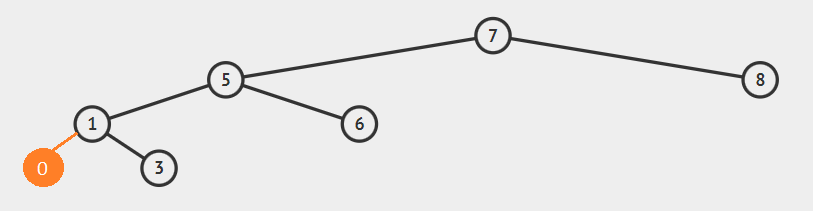

# Insertion Sort Project

Our array is: [22, 27, 16, 2, 18, 6]

A) States
1. [22, 27, 27, 2, 18, 6] => key = 16
2. [22, 22, 27, 2, 18, 6] => key = 16
3. [16, 22, 27, 2, 18, 6] => key = 16
4. [16, 22, 27, 2, 18, 6] => key = 2
5. [16, 22, 27, 27, 18, 6] => key = 2
6. [16, 22, 22, 27, 18, 6] => key = 2
7. [16, 16, 22, 27, 18, 6] => key = 2
8. [2, 16, 22, 27, 18, 6] => key = 2
9. [2, 16, 22, 27, 18, 6] => key = 18
10. [2, 16, 22, 27, 27, 6] => key = 18
11. [2, 16, 22, 22, 27, 6] => key = 18
12. [2, 16, 18, 22, 27, 6] => key = 18
13. [2, 16, 18, 22, 27, 6] => key = 6
14. [2, 16, 18, 22, 27, 27] => key = 6
15. [2, 16, 18, 22, 22, 27] => key = 6
16. [2, 16, 18, 18, 22, 27] => key = 6
17. [2, 16, 16, 18, 22, 27] => key = 6
18. [2, 6, 16, 18, 22, 27]

Final state is at step 18.

B) Big O Notation of This Case

O(n^2)

C) Time Complexity of Insertion Sort

Average Case: O(n^2)
Worst Case: O(n^2)
Best Case: O(n)

D) After Sorting

18 sayısını aramak Best Case kapsamına girer.

Second array is: [7, 3, 5, 8, 2, 9, 4, 15, 6]

A) States
1. [7, 3, 5, 8, 2, 9, 4, 15, 6] => key = 3
2. [7, 7, 5, 8, 2, 9, 4, 15, 6] => key = 3
3. [3, 7, 5, 8, 2, 9, 4, 15, 6] => key = 3
4. [3, 7, 5, 8, 2, 9, 4, 15, 6] => key = 5
5. [3, 7, 7, 8, 2, 9, 4, 15, 6] => key = 5
6. [3, 5, 7, 8, 2, 9, 4, 15, 6] => key = 5
7. [3, 5, 7, 8, 8, 9, 4, 15, 6] => key = 2
8. [3, 5, 7, 7, 8, 9, 4, 15, 6] => key = 2
9. [3, 5, 5, 7, 8, 9, 4, 15, 6] => key = 2
10. [3, 3, 5, 7, 8, 9, 4, 15, 6] => key = 2
11. [2, 3, 5, 7, 8, 9, 4, 15, 6] => key = 2

After 4 steps this array should be like above.

# Merge Sort Project

Our array is: [16, 21, 11, 8, 12, 22]

A) States
1. [16, 21, 11] v [8, 12, 22]
2. [16] v [21, 11] v [8] v [12, 22]
3. [16] v [21] v [11] v [8] v [12] v [22]
4. [16] v [11, 21] v [8] v [12] v [22]
5. [11, 16, 21] v [8] v [12] v [22]
6. [11, 16, 21] v [8] v [12, 22]
7. [11, 16, 21] v [8, 12, 22]
8. [8, 11, 12, 16, 21, 22]

B) Big O Notation of Merge Sort

Best Case: O(n logn)
Worst Case: O(n logn)
Average Case: O(n logn)

# Binary Search Tree Project

Root 7 olacak şekilde ağaç yapımızı başlatırız.

Soluna 5 eklenir.

5'in soluna 1 eklenir.

7'nin (root'un) sağına 8 eklenir.

1'in sağına 3 eklenir.

5'in sağına 6 eklenir.

1'in soluna 0 eklenir.

8'in sağına 9 eklenir.

3'ün sağına 4 eklenir.

3'ün soluna 2 eklenir.

## [Patika.dev](https://www.patika.dev/tr)